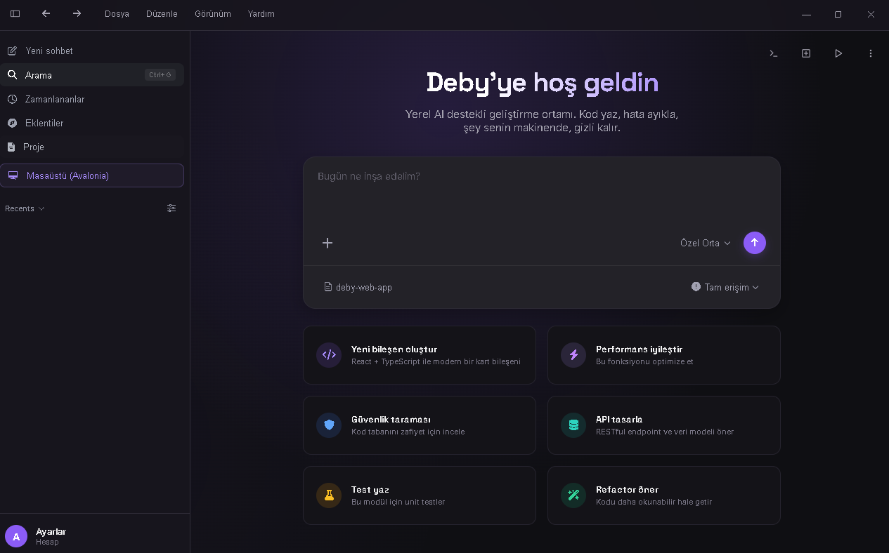

  

# Deby

## Selamünaleyküm

Öncelikle sözlerime şu ifadeyle başlamak istiyorum:

> "Sürçülisan ettiysem affola."

Ve şu sözle devam etmek istiyorum:

> "İnsan, olduğu yeri güzelleştirmiyorsa insan değildir."

İnsan olarak bir işi yaparken, yapabildiğinin en iyisini yapmak zorundadır. Her ne iş olursa olsun, özellikle de ben Müslümanım; aksi söz konusu olmamalıdır.

Yapmış olduğum ve yapmayı planladığım her işte düşüncem bu yönde ilerliyor. Benim düşünce yapım ve fikirlerim de bu doğrultudadır.

---

## Bu Proje Nasıl Başladı?

Uzun süredir kendi iç dünyamda her zaman bir şeyler tasarlardım; fakat hiçbirini hayata geçirmezdim.

Çünkü her şey imkân dâhilindedir.

İnsan sınırlarını bilmek zorundadır ve yapabileceklerini de...

Kısacası insan kendi haddini bilirse, kimsenin ona haddini bildirmesine gerek kalmaz.

Pandemi, savaş ve son olarak depremi yaşadıktan sonra aklıma dank eden bir düşünce oldu.

Herkes gibi ben de bir gün öleceğim.

Öyle ya da böyle...

Bu değişmeyecek bir kural.

Peki ben öldükten sonra insanlara geriye ne bırakacağım?

Şu ana kadar insanlık adına gerçekten faydalı ne yaptım?

Evet...

Kafamda birçok proje vardı.

Ama hangisini yapmalıydım?

Bilgi çağındayız.

Teknoloji çağındayız.

Peki insanlığa gerçekten en fazla faydayı ne sağlayabilirdim?

Bir uygulama mı?

Bir oyun mu?

Bir internet sitesi mi?

Hayır...

Bunların hiçbiri ne zihnimdekilere ne de düşünce yapıma ve inancıma uyuyordu.

Bu yüzden yapay zekâ geliştirmek istedim.

Uzun süre bunun üzerine çalıştım.

Fakat yapay zekâ geliştirme konusunda yeterince tecrübeli olmadığım için iki büyük sorunla karşı karşıya kaldım.

1. Çok güçlü donanım ihtiyacı.
2. Bu donanımın beraberinde getirdiği maliyet ve işletme giderleri.

Bu altyapıyı tasarladım.

Fakat daha fazla zaman kaybetmemek adına o projeyi bulunduğu noktada bıraktım.

---

## Yerel Editör Fikri

Sonrasında yerel çalışan bir editör geliştirmeye karar verdim ve çalışmaya başladım.

Daha sonra bugün bilinen bazı açık kaynak projeler de ortaya çıktı.

Tek başıma çalıştığım için süreç oldukça uzun sürdü.

Üstelik o dönem hâlâ depremin artçı sarsıntıları devam ediyordu.

Sürekli elektrik kesintileri yaşanıyordu.

Derken disk sürücüm arızalandı.

Bütün çalışmamı kaybettim.

Yılmadım.

Tekrar başladım.

Bu kez yapay zekâ yardımıyla geliştirme yapıyordum.

Ancak o dönemde yapay zekânın yaptığı bir hata nedeniyle, üstelik yedek de almadığım için, tüm çalışmalarım bir kez daha silindi.

Bugün ise projeye yeniden başladım.

Ancak bu kez bir editör olarak değil...

Bir **Agent Operating System (Agent OS)** olarak ele aldım.

Çünkü insanlar ilerliyor.

Teknoloji ilerliyor.

Benim hâlâ yalnızca bir editör geliştirmem artık anlamsız olurdu.

Bu yüzden "Agent OS" dedim.

Özellikle belirtmek istiyorum ki bu isim, "Agent Code" gibi mevcut ürünlerle karıştırılmamalıdır.

Proje tamamen yerel çalışacaktır.

Tamamen kapalı kaynak olacaktır.

Ve ücretli olarak yayımlanacaktır.

Bunun özellikle altını çizmek istiyorum.

Çünkü geçmişte yapay zekâ projesini yarıda bırakmama neden olan sebepler bugün de geçerliliğini koruyor.

Amacım bir Agent OS geliştirip satmak ve bundan gelir elde etmek değildir.

Amacım çok daha büyük, uzun vadeli; ciddi zaman, emek ve bütçe gerektiren başka bir projeyi gerçekleştirebilmektir.

Bu ihtiyaçları tek başıma karşılamam mümkün değildir.

Bu nedenle Agent OS kapalı kaynak ve ücretli olacaktır.

---

## Projenin Mevcut Durumu

Şu ana kadar proje kapsamında genel olarak %35–40 seviyesine ulaştım.

Bunu yalnızca ücretsiz API modellerini kullanarak gerçekleştirdim.

Malum olduğu üzere ücretsiz API modelleri, yeni modelleri eğitmek ve yaygınlaştırmak amacıyla ücretsiz sunuluyor. Ancak bu modeller, projemin ihtiyaç duyduğu seviyede yeterli olmadıkları için geliştirme sürecini ciddi anlamda yavaşlatıyor.

Üstelik burada yalnızca hız problemi de yok.

Güvenlik ve gizlilik açısından da ciddi sorunlar bulunuyor.

Kapalı kaynak bir proje geliştirmeye çalışırken, kullandığım modeller nedeniyle kaynak kodum üçüncü taraf sistemlere gönderiliyor.

Dolayısıyla "kapalı kaynak" dememe rağmen, mevcut imkânsızlıklar nedeniyle bunu tam anlamıyla sağlayamıyorum.

Benim amacım kaynak bulabilmek.

Yerel çalışan büyük modeller kullanarak projemi tamamlamak istiyorum.

Fakat bunun için güçlü bir geliştirme altyapısına ihtiyacım var.

Planladığım donanım şu şekildedir:

- 3 adet RTX 6000
- 1 TB DDR5 RAM
- Bu donanıma uygun üst seviye anakart
- Güçlü bir işlemci
- Yüksek hızlı SSD ve depolama altyapısı

Peki neden bu kadar güçlü bir sistem?

Çünkü projem şu an itibarıyla yaklaşık **150.000 satır (LOC)** kaynak koda sahip.

Projenin tamamlandığında yaklaşık **400.000–500.000 satır** kaynak koda ulaşacağını tahmin ediyorum.

Elbette bu sayı daha az veya daha fazla olabilir.

Böylesine büyük bir projeyi 3B, 7B, 30B veya 70B seviyesindeki modellerle tek başıma geliştirmem oldukça zor.

Elbette istersem yıllarca uğraşarak bunu yapabilirim.

Fakat o zamana kadar yaşayacak mıyım, yaşamayacak mıyım bilmiyorum.

Ya da o zamana kadar büyük teknoloji şirketlerinin hangi seviyeye ulaşacağını da bilmiyorum.

Bu nedenle zamana karşı yarışıyorum.

---

## Neden Bağış İstiyorum?

Şimdi asıl konuya gelelim.

Evet.

Benim bağışa ihtiyacım var.

Ve bunu sorgusuz sualsiz söylüyorum.

Neden böyle söylediğimi açıklamak istiyorum.

Yukarıda da belirttiğim gibi, gerçekleştirmek istediğim farklı projeler bulunuyor.

Bunları başarabilir miyim, başaramaz mıyım bilmiyorum.

Çünkü yarın başıma ne geleceğini de bilmiyorum.

Tek başıma çalışıyorum.

Arkamda ikinci bir kişi yok.

Gerçekçi olalım.

Kimseyi kandırmaya da gerek yok.

Hayalim büyük.

Vizyonum büyük.

Fakat her şey imkânlar dâhilinde gerçekleşebilir.

Şu anda projemi paylaşamam.

Açık kaynak yapamam.

"Bakın böyle bir projem var." diyemem.

"Demosu burada." diyemem.

Bunun sebeplerini yukarıda anlattım.

Bugün tüm vizyonumu buraya yazsam...

Varsayalım ki bunu büyük bir şirket veya büyük bir ekip gördü.

Günümüzde kullanılan güçlü modellerle bu fikirlerin gerçekleştirilmesi imkânsız değildir.

Bunu daha önce de yaşadım.

"Agent Code" dediğim dönemde benzer sistemler henüz yaygın değildi.

Daha sonra VS Code tabanlı birçok Agent Code sistemi ortaya çıktı.

Yerel çalışan Agent Code fikri de kısa süre içerisinde birçok platform tarafından desteklenmeye başladı.

Bugün artık birçok Agent Code sistemi yalnızca bir API anahtarı veya URL ile istediğiniz modeli kullanmanıza izin veriyor.

Bu yüzden risk almak istemiyorum.

Çünkü her şeye sahip olan istediğini yapabilir.

Fakat hiçbir şeye sahip olmayan bir insanın riske atabileceği ikinci bir şansı olmayabilir.

---

## Son Söz

Evet.

Bağış istiyorum.

Ve bunu hiçbir kanıta dayanmadan, yalnızca sözlerime güvenerek yapmanızı istiyorum.

Kim olursanız olun...

İster çok büyük bir iş insanı olun...

İster benim gibi sıradan bir insan olun...

Hiçbiriniz hiçbir konuda zorunlu değilsiniz.

Kimse kimseye borçlu değildir.

Benim bir hayalim var.

Ve bu hayali gerçekleştirebilmek için her gün yaklaşık 16 saat bilgisayar başında çalışıyorum.

Size her şeyi anlatmıyorum.

Çünkü anlatamam.

Yalnızca hayallerimin ve vizyonumun yansımasını paylaşabiliyorum.

Sizden beklentim ise bana güvenmeniz ve imkânınız varsa maddi veya manevi olarak destek olmanızdır.

Şuna da inanmıyorum:

Bir projeye destek verebilmek için mutlaka açık kaynak olması,

Tüm vizyonunun bilinmesi,

Her ayrıntısının gösterilmesi,

Her iddiasının önceden kanıtlanması gerektiğine inanmıyorum.

Eğer dünyada insanlar yalnızca bu şartlar sağlandığında destek verseydi, bugün bulunduğumuz noktaya ulaşamazdık.

Her gün milyonlarca dolar bağış yapılıyor.

Yemek için...

Sağlık için...

Kıyafet için...

Eşya için...

Hatta bazen insanların yalnızca kişisel istekleri veya borçları için bile.

Daha önce de söylediğim gibi;

Hiç kimse hiçbir konuda zorunlu değildir.

Hiç kimse kimseye borçlu değildir.

Eğer mutlaka bir kanıt görmek istiyorsanız, benimle iletişime geçebilirsiniz.

Bulunduğum yere gelip projeyi kendi gözlerinizle görebilirsiniz.

Şimdilik söyleyeceklerim bu kadar.

Yardım eden...

Yardım etmeyen...

Ya da yalnızca bu yazıyı okuyarak bana zaman ayıran herkese...

Teşekkür ederim.

Sağ olun.
